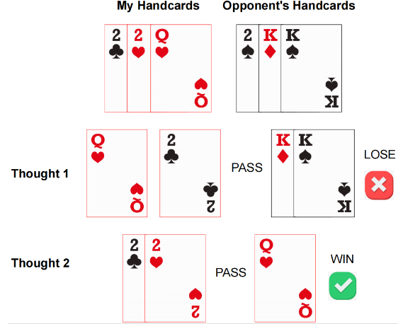
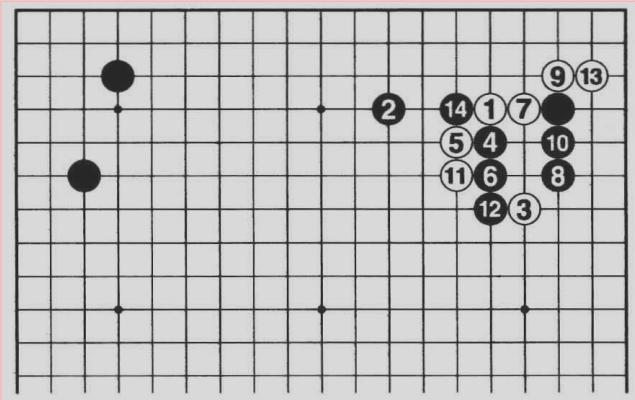
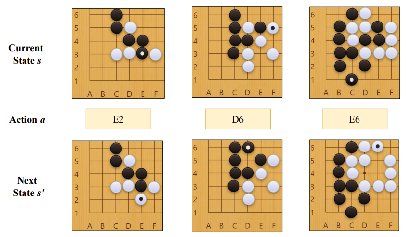
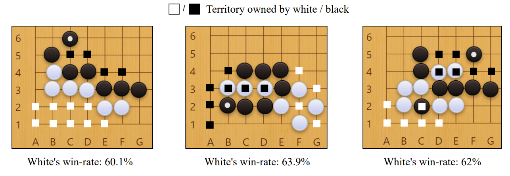

# README

To enhance the reproducibility of MasterMind, we provide part of the training data and demo training code required for the tasks of Dou Dizhu and Go in this repository.

### Summary

The dataset in ``./data`` contains the expert dataset for the Doudizhu and Go tasks proposed in MasterMind. In summary, this dataset uses a QA format, with the question part providing the current state of the game; the answer part provides the corresponding game-playing strategy and the logic behind adopting this strategy. The dataset encodes all the above information in string format, all expert information is automatically generated by agents.

This repository also includes the code for fine-tuning the base model using Instruct tuning. By default, we use the LLaMA model as the base model and apply LoRA technology for parameter fine-tuning.

### Quick Start

Here is a simple tutorial for applying instruct tuning on this dataset:

- Install torch==2.2.2. You can directly run the following command to install it with cuda==11.8. For other version, please view the official tutorial: [PyTorch](https://pytorch.org/)

```
pip install torch==2.2.2 --index-url https://download.pytorch.org/whl/cu118
```

- Install other requirements by:

```
pip3 install -r requirements.txt
```

- Run our demo code for Doudizhu:

```
python train_dou.py
```

​	, or for Go:

```
python train_go.py
```

### Data Examples

For the Doudizhu data, each data point primarily includes: the current hand, possible card-playing strategies, the opponent's potential responses to each strategy, and the final decision on which card to play. An example is as follows:



For the Go data, the dataset includes predicting the next state, predicting the territory analysis provided by KataGo, predicting the explanations given by human players, and win rate predictions. Some specific examples are as follows:



**Explanation:** When White 1 hangs high on the upper right, the preparations for Black 2's attack are taken into account beforehand. When White 3 comes over, Black 4's move to 12 is followed by White 13's move, and Black 14's break is related to the introduction.

              